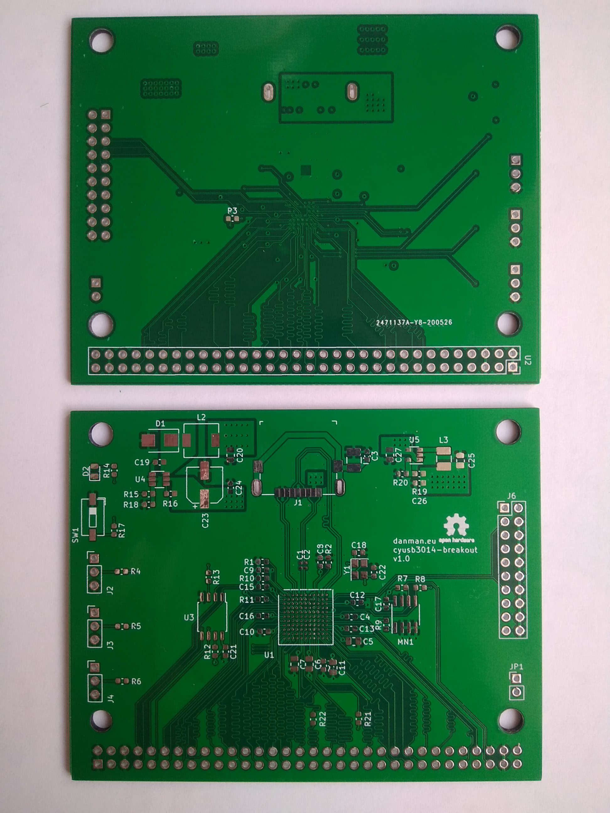

View this project on [CADLAB.io](https://cadlab.io/project/23305). 

# Cypress FX3 CYUSB3014 breakout board

## Hardware

This design is a copy of QM Tech board: https://github.com/ChinaQMTECH/QM_CYUSB3014_USB3.0

You can find the most recent schematic in releases https://github.com/danielkucera/cyusb3014-breakout/releases

## Software

For quick testing of the board you can use the SPI image and python script from folder [software](/software)

These are my results for bulk loop test:

## I want one

Contact me in some way, I have some spare boards, I can send you a bare board or an assembled one for some small donation.
